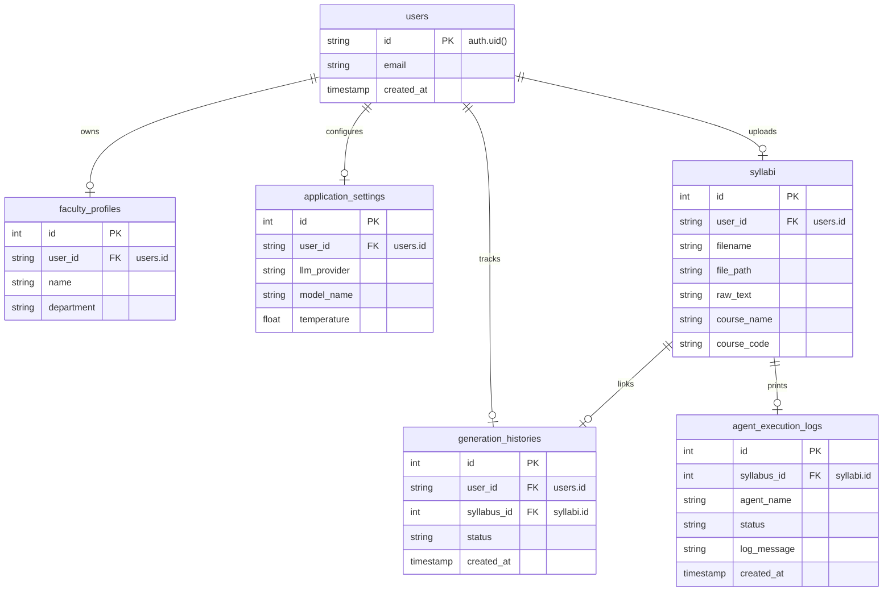

# Database & Supabase Documentation
> **LPU Academic Copilot — PostgreSQL Relational Schema, Tables, and Supabase Configurations**

The database is built on **Supabase PostgreSQL**, managed locally via SQLAlchemy models and migrated using Alembic. 

---

## 1. Relational Schema ER Diagram

The relational layout links users to their settings, history, and generated academic packs:

---

## 2. Table Specifications

### A. `users`
* Contains basic profile sync info from Supabase Auth.
* Column `id` is a `TEXT` matching the Supabase UID.

### B. `syllabi`
* Stores the parsed text and PDF storage location.
* Columns: `id` (serial), `user_id` (foreign key), `filename`, `file_path`, `raw_text`, `course_name`, `course_code`.

### C. `agent_execution_logs`
* Tracks the logs displayed in the frontend timeline.
* Columns: `id`, `syllabus_id` (foreign key), `agent_name`, `status` (`STARTED`, `COMPLETED`, `FAILED`), `log_message`, `created_at`.

---

## 3. Supabase Storage Integration
The application uses two buckets in Supabase Object Storage:
1. **`syllabi`**: Stores the uploaded syllabus PDFs.
2. **`reports`**: Stores the generated Course Pack report PDFs.

The backend uses the `SUPABASE_SERVICE_ROLE_KEY` to authenticate storage requests, bypassing client RLS policies during PDF write operations.
