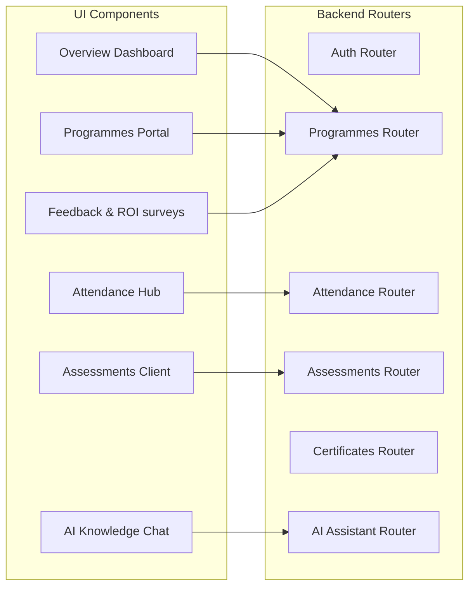
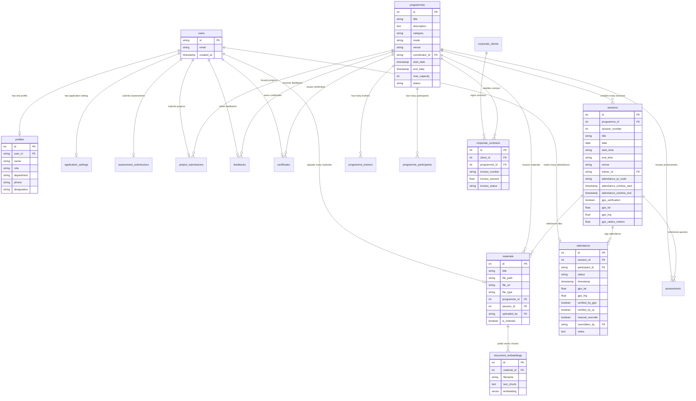
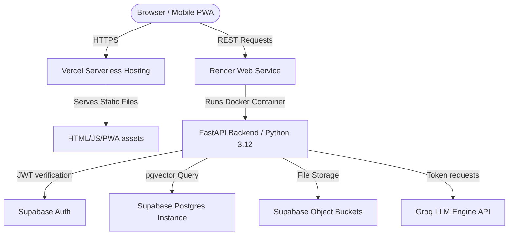
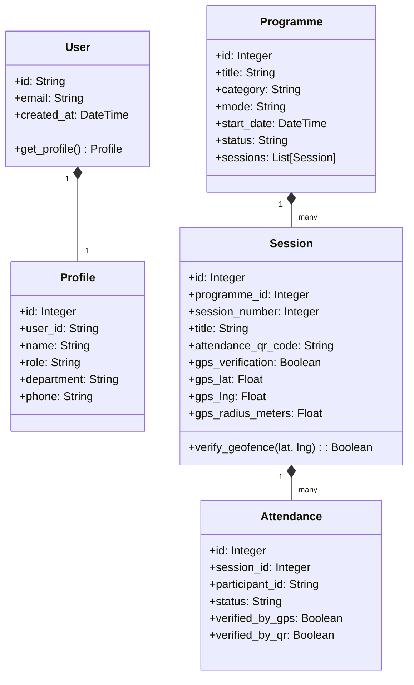
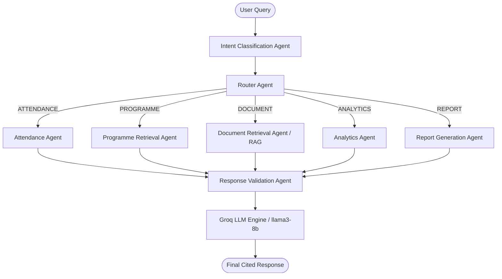

# System Architecture & Diagrams Documentation
> **LPU HRDC Nexus — Enterprise Platform Blueprint & Diagrams**

LPU HRDC Nexus is an enterprise-grade Progressive Web App (PWA) designed to manage the end-to-end lifecycle of training programmes. It integrates Next.js 15, FastAPI, Supabase, Groq APIs, and a LangGraph AI reasoning workflow backed by pgvector RAG.

---

## 1. System Architecture Diagram
The high-level architecture decouples presentation, application logic, database storage, and AI reasoning.

```mermaid
graph TB
    subgraph Presentation Layer (PWA Client)
        FE[Next.js 15 Frontend / React 19] -->|Install stand-alone app| PWA[Installable Mobile/Desktop Client]
        FE -->|JWT Bearer Token| API_Gateway[FastAPI Endpoints]
    end

    subgraph Application Layer (FastAPI Backend)
        API_Gateway --> Auth_Dep[Auth Dependency / JWT Validation]
        API_Gateway --> CRUD_Svc[CRUD Service Core]
        API_Gateway --> Agent_Svc[LangGraph AI Orchestrator]
    end

    subgraph Storage & External Services
        Auth_Dep -->|Validate token| Supa_Auth[Supabase Auth]
        CRUD_Svc -->|SQLAlchemy Core / SQLite Fallback| Postgres[(Supabase PostgreSQL)]
        CRUD_Svc -->|Binary file upload| Storage[(Supabase Storage)]
        Agent_Svc -->|Embeddings RAG queries| pgvector[(pgvector Index)]
        Agent_Svc -->|LLM Completion| Groq[Groq Cloud LLM API]
    end
```

---

## 2. Component Diagram
Shows how different structural modules in the system interact.



---

## 3. Database Entity-Relationship (ER) Diagram
Shows the complete PostgreSQL database structure for LPU HRDC Nexus.



---

## 4. Deployment Diagram
LPU HRDC Nexus is a cloud-native platform utilizing Render, Vercel, and Supabase.



---

## 5. Sequence Diagram
Shows the sequence of logging geofenced and QR-validated classroom attendance.

```mermaid
sequenceDiagram
    autonumber
    actor Participant as User Participant
    participant App as Next.js Client
    participant API as FastAPI Backend
    participant DB as Postgres Database

    Participant->>App: Scan classroom QR & request check-in
    App->>App: Acquire Geolocation coordinates (navigator.geolocation)
    App->>API: POST /api/sessions/{id}/attendance (QR code, lat, lng)
    API->>DB: Fetch session attendance parameters (lat, lng, radius, QR hash, window)
    DB-->>API: Session configuration details
    API->>API: Verify scan time is within window
    API->>API: Verify QR code matches hash
    API->>API: Calculate distance between user coordinates & classroom center
    alt Validation Passed
        API->>DB: Save Attendance log (Present/Late)
        DB-->>API: Success
        API-->>App: Return 200 (Attendance marked)
        App-->>Participant: Present indicator marked successfully!
    else Validation Failed
        API-->>App: Return 400 (Verification Error)
        App-->>Participant: Display Out-Of-Boundary/Expired Error
    end
```

---

## 6. Class Diagram
Represents the key object schemas inside the FastAPI app.



---

## 7. LangGraph Workflow Diagram
Defines the multi-agent reasoning flow executed during AI Knowledge Assistant queries.



---

## 8. RAG Architecture Diagram
Defines how documents (PDFs, PPTs, DOCXs) are chunked, embedded, stored, and queried.

```mermaid
graph TD
    subgraph Ingestion Pipeline (Background Task)
        Doc[Uploaded PDF/PPT/Word File] --> Parser[PDFParser / Text Extractor]
        Parser --> Chunker[Chunker: 600 words + 150 overlap]
        Chunker --> Embedder[Offline ADA-002 Embedder Simulator]
        Embedder --> DB_Insert[Save Chunk & Embedding into public.document_embeddings]
    end

    subgraph Retrieval Pipeline (LangGraph Workflow)
        Query[User Chat Query] --> QueryEmbed[Embed Query Text]
        QueryEmbed --> VectorSearch[Cosine Similarity Search using pgvector hnsw]
        DB_Insert -->|Seed embeddings| pgvector[(Supabase pgvector Index)]
        pgvector -->|Return top 4 matched chunks| VectorSearch
        VectorSearch --> LLMContext[Compile into LLM system context]
    end
```
