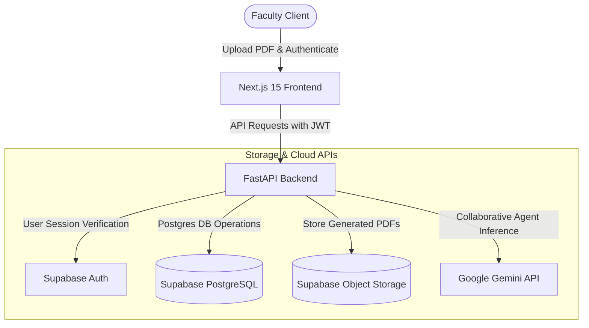

# System Architecture
> **LPU Academic Copilot — Platform System Architecture & Data Flows**

The LPU Academic Copilot is a full-stack, decupled multi-agent AI system designed to automate academic syllabus parsing, lesson planning, assignment synthesis, quiz generation, cognitive mapping (Bloom's Taxonomy), course outcome alignment, quality reviewing, and PDF generation.

---

## 1. High-Level Design Architecture

The application is structured into three main layers:
1. **Frontend Presentation Layer**: Built with **Next.js 15 (App Router)** and React 19 to provide a rich visual workspace for faculty.
2. **Backend Services Layer**: Built with **FastAPI** (Python 3.12/3.14) to run asynchronous agent workflows, handle file parsing, and serve RESTful APIs.
3. **Storage & Authentication Layer**: Powered by **Supabase (PostgreSQL & Object Storage)** to manage authentication, application logs, generation histories, and compiled PDF reports.

---

## 2. Multi-Agent Orchestration Workflow

When a syllabus is uploaded, a background task triggers the **Multi-Agent Orchestrator**. The orchestrator manages the lifecycle, execution order, context passing, and fallback mechanisms for **10 specialized nodes**:

```mermaid
sequenceDiagram
    autonumber
    actor Faculty as Faculty User
    participant Upload as /api/upload
    participant System as System Logger
    participant Parser as PDF Parser
    participant Orchestrator as Multi-Agent Orchestrator
    participant Gemini as Gemini 1.5 Flash
    participant DB as Supabase DB
    
    Faculty->>Upload: Uploads Syllabus PDF
    Upload->>Parser: Extract text from PDF
    Parser-->>Upload: raw text
    Upload->>DB: Save Syllabus Row (PENDING)
    Upload->>Orchestrator: Dispatch background task
    Upload-->>Faculty: Return 200 (PROCESSING)
    
    Note over Orchestrator: Phase 1: Planning Node
    Orchestrator->>Gemini: PlanningAgent (Syllabus text)
    Gemini-->>Orchestrator: Extracted Structure (JSON)
    Orchestrator->>DB: Log Planning COMPLETED
    
    Note over Orchestrator: Phase 2: Content Generation (Parallelizable)
    rect rgb(20, 20, 20)
        par Planning Data to Lesson Planner
            Orchestrator->>Gemini: LessonPlanAgent
            Gemini-->>Orchestrator: 15-Week Plan
        and Planning Data to Assignment Creator
            Orchestrator->>Gemini: AssignmentAgent
            Gemini-->>Orchestrator: 3 Assignments
        and Planning Data to Quiz Bank Generator
            Orchestrator->>Gemini: QuizAgent
            Gemini-->>Orchestrator: 20 MCQs
        and Planning Data to Question Paper Creator
            Orchestrator->>Gemini: QuestionPaperAgent
            Gemini-->>Orchestrator: Mid/End-Sem Papers
        and Planning Data to Bloom Taxonomy Evaluator
            Orchestrator->>Gemini: BloomAgent
            Gemini-->>Orchestrator: Cognitive Map
        end
    end
    
    Note over Orchestrator: Phase 3: Alignment & Quality Review
    Orchestrator->>Gemini: COMappingAgent (Questions + Outcomes)
    Gemini-->>Orchestrator: Mapping Table
    Orchestrator->>Gemini: ReviewerAgent (Consistency check)
    Gemini-->>Orchestrator: Approved/Changes
    Orchestrator->>Gemini: AcademicQualityAgent (Score & suggestions)
    Gemini-->>Orchestrator: Quality Metrics (JSON)
    
    Note over Orchestrator: Phase 4: Compilation
    Orchestrator->>Orchestrator: PDFGenerator (Compile report)
    Orchestrator->>DB: Save PDF URL and COMPLETED status
    System-->>Faculty: Status loop returns COMPLETED
```

---

## 3. Data Integration Details

### A. Authentication flow
1. User logs in on the Next.js frontend using Supabase Auth.
2. Next.js retrieves the **JWT access token** from the session.
3. Every subsequent HTTP request to Render includes the token in the `Authorization: Bearer <TOKEN>` header.
4. FastAPI's `get_current_user` dependency decodes the JWT using the public Supabase key to verify user identities.

### B. CORS Configuration
CORS policies are configured to explicitly allow traffic from the Vercel production domain (`https://frontend-five-gules-38.vercel.app`) as well as local development environments, preventing pre-flight request blocks.

### C. Database Connection Pooler
Outbound network requests from Render (which uses IPv4) connect to Supabase through the **Transaction Pooler** (port `6543`) resolving to an IPv4 host, bypassing IPv6-only direct connection issues.
