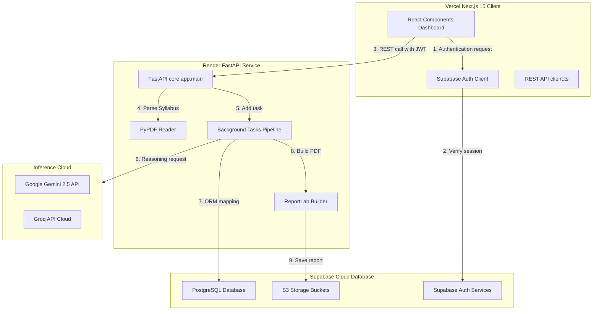
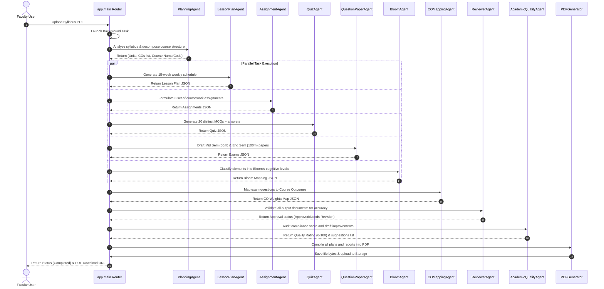

# LPU Academic Copilot — Architecture and Design Guide

This document describes the database entity relationships, system architecture, multi-agent sequence diagrams, and API design specifications.

---

## 1. System Architecture Diagram
The platform follows a decoupled, containerized multi-tier model.



---

## 2. Database ER Diagram
The PostgreSQL relational model maps course data and logs, enforcing Row Level Security (RLS) policies relative to users.

```mermaid
erDiagram
    users ||--|| faculty_profiles : "has one"
    users ||--o{ syllabi : "uploads"
    users ||--|| application_settings : "has settings"
    users ||--o{ generation_histories : "starts"
    
    syllabi ||--o{ lesson_plans : "produces"
    syllabi ||--o{ assignments : "produces"
    syllabi ||--o{ quizzes : "produces"
    syllabi ||--o{ question_papers : "produces"
    syllabi ||--o{ bloom_taxonomy_reports : "aligns"
    syllabi ||--o{ co_mapping_reports : "aligns"
    syllabi ||--o{ academic_quality_reports : "scores"
    syllabi ||--o{ generated_pdf_reports : "stores"
    syllabi ||--o{ agent_execution_logs : "tracks"
    syllabi ||--o{ generation_histories : "references"

    users {
        string id PK "Supabase UID"
        string email
        datetime created_at
    }

    faculty_profiles {
        int id PK
        string user_id FK "References users.id"
        string name
        string department
        datetime created_at
    }

    syllabi {
        int id PK
        string user_id FK "References users.id"
        string filename
        string file_path
        string raw_text
        string course_name
        string course_code
        datetime created_at
    }

    lesson_plans {
        int id PK
        int syllabus_id FK "References syllabi.id"
        string title
        jsonb content "Weekly topics list"
        datetime created_at
    }

    assignments {
        int id PK
        int syllabus_id FK "References syllabi.id"
        string title
        jsonb content "Question descriptions"
        datetime created_at
    }

    quizzes {
        int id PK
        int syllabus_id FK "References syllabi.id"
        string title
        jsonb content "20 MCQs with explanation key"
        datetime created_at
    }

    question_papers {
        int id PK
        int syllabus_id FK "References syllabi.id"
        string exam_type "Mid-Sem / End-Sem"
        jsonb content "Questions per section"
        datetime created_at
    }

    bloom_taxonomy_reports {
        int id PK
        int syllabus_id FK "References syllabi.id"
        jsonb content "K1-K6 cognitive distributions"
        datetime created_at
    }

    co_mapping_reports {
        int id PK
        int syllabus_id FK "References syllabi.id"
        jsonb content "CO mapping matrix"
        datetime created_at
    }

    academic_quality_reports {
        int id PK
        int syllabus_id FK "References syllabi.id"
        float score "0-100 rating"
        jsonb suggestions "Suggestions list"
        jsonb content "Metrics breakdown"
        datetime created_at
    }

    generated_pdf_reports {
        int id PK
        int syllabus_id FK "References syllabi.id"
        string file_path "Storage key path"
        string file_url "Supabase storage public link"
        datetime created_at
    }

    agent_execution_logs {
        int id PK
        int syllabus_id FK "References syllabi.id"
        string agent_name "Execution node"
        string status "STARTED / COMPLETED / FAILED"
        string log_message
        datetime created_at
    }

    application_settings {
        int id PK
        string user_id FK "References users.id"
        string llm_provider
        string model_name
        float temperature
        datetime updated_at
    }

    generation_histories {
        int id PK
        string user_id FK "References users.id"
        int syllabus_id FK "References syllabi.id"
        string status "PENDING / PROCESSING / COMPLETED / FAILED"
        datetime created_at
    }
```



---

## 3. Multi-Agent Orchestration Sequence
The workflow shows how the agents coordinate to review and compile materials.



---

## 4. API Documentation

### 4.1. Base URL
`http://localhost:8000/api`

### 4.2. Authentication Header
For all secure endpoints, include:
```http
Authorization: Bearer <Supabase_JWT_Token>
```

### 4.3. REST Endpoints

#### `POST /profile`
Saves or updates faculty member details.
- **Request Body**:
  ```json
  {
    "name": "Dr. Amanpreet Singh",
    "department": "Computer Science & Engineering",
    "user_id": "auth-uuid"
  }
  ```
- **Response (200 OK)**:
  ```json
  {
    "id": 1,
    "user_id": "auth-uuid",
    "name": "Dr. Amanpreet Singh",
    "department": "Computer Science & Engineering",
    "created_at": "2026-07-05T14:00:00Z"
  }
  ```

#### `GET /settings`
Gets LLM settings.
- **Response (200 OK)**:
  ```json
  {
    "llm_provider": "gemini",
    "model_name": "gemini-2.5-flash",
    "temperature": 0.7,
    "id": 1,
    "user_id": "auth-uuid",
    "updated_at": "2026-07-05T14:00:00Z"
  }
  ```

#### `PUT /settings`
Updates LLM settings.
- **Request Body**:
  ```json
  {
    "llm_provider": "groq",
    "model_name": "mixtral-8x7b-32768",
    "temperature": 0.5
  }
  ```
- **Response (200 OK)**:
  *Returns updated settings model.*

#### `POST /upload`
Uploads a syllabus PDF. Triggers the agent pipeline in the background.
- **Request Body**: Multipart form data with a `file` field containing the PDF.
- **Response (200 OK)**:
  ```json
  {
    "syllabus_id": 12,
    "filename": "Modern_AI_Syllabus.pdf",
    "status": "PROCESSING",
    "message": "Syllabus parsing done. Agent workflow running in the background."
  }
  ```

#### `GET /status/{syllabus_id}`
Checks the progress of the multi-agent pipeline.
- **Response (200 OK)**:
  ```json
  {
    "syllabus_id": 12,
    "status": "PROCESSING",
    "logs": [
      {
        "id": 45,
        "syllabus_id": 12,
        "agent_name": "PlanningAgent",
        "status": "COMPLETED",
        "log_message": "Extracted syllabus details successfully.",
        "created_at": "2026-07-05T14:02:10Z"
      },
      {
        "id": 46,
        "syllabus_id": 12,
        "agent_name": "LessonPlanAgent",
        "status": "STARTED",
        "log_message": "Constructing 15-week weekly delivery schedule.",
        "created_at": "2026-07-05T14:02:12Z"
      }
    ]
  }
  ```

#### `GET /report/{syllabus_id}`
Retrieves the compiled JSON report data.
- **Response (200 OK)**:
  *Returns a complete `FullReportResponse` containing aggregated structures (Lesson plan weeks, MCQs list, exam papers).*

#### `GET /download/{syllabus_id}`
Streams the compiled ReportLab PDF report.
- **Response (200 OK)**: Binary stream (`application/pdf`) with `Content-Disposition` header.
